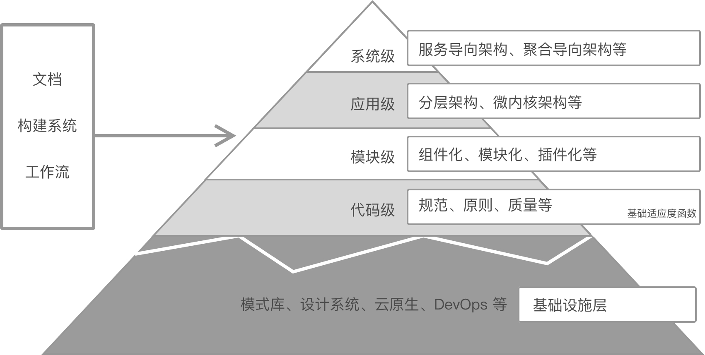
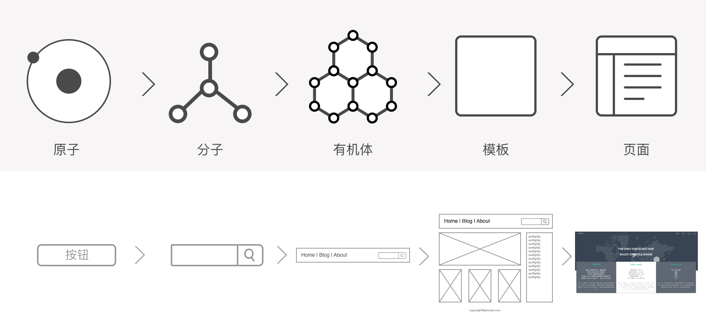
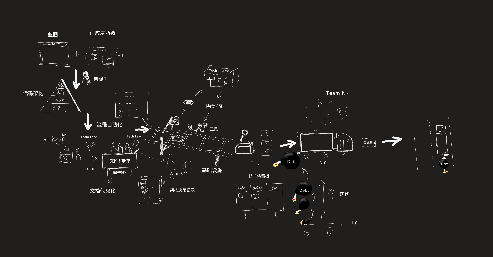
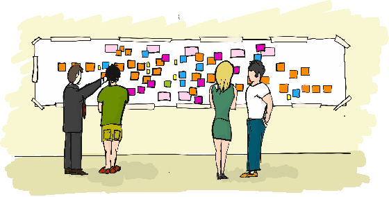

# 构建可信软件系统

或许是软件正在吞噬世界，或许是软件不断被重写，越来越多的架构师、资深程序员开始关注起软件质量。在最近的一两年里，这种趋势愈来愈加明显，诸如于：

1. 重构到领域驱动设计的架构
2. 设计出演进式架构的系统
3. …… （编不下去了）

在这背后的主要原因是，我们为了**更快的交付出软件**。一个代码臃肿的后端单体系统，既不利于新人加入系统（他们会吐槽系统的复杂性），也不利于对系统的部分重构。而若是一个采用微服务架构的系统，每部分的代码量都相当地小，能加快开发速度，也能快速方便的重写。这让我不禁联想到之前同事说过的一个观点：

 - 为什么微服务成本很高，要将单体应用改成微服务？
 - 为什么中台并不能解决问题，但是还是要做中台？
 - 为什么微前端不是银弹，但是我们仍然想做微服务？
 - ……

『因为代码写得烂吧，质量上不去，自然需要找个**好的理由**来重写应用』。旧的代码不好维护，只是其中的一个理由。现在，加上了新的技术、新的架构，已然变成了两个理由了，也就是一个好的理由。

## 引子 1：代码到架构的腐烂

架构的腐烂来自于代码的坏味道，而代码的坏味道则是属于技术债务，于是乎技术债务的无力偿还才是代码质量背后的问题。这里的技术债务，指的是**为了快速解决问题而采取的不规范方案** [^tech_debt]。而如《软件设计重构》一书所提及的，这些相关的技术债务有：

[^tech_debt]: https://www.infoq.cn/article/xgP9W*MC6Svi9Zcqd5KX

 - **代码债务**：代码风格不一致、静态分析的违规
 - **设计债务**：设计坏味道、违反设计原则 
 - **测试债务**：测试不充分、测试设计不合理
 - **文档债务**：缺少文档、文档糟糕及文档过期

但是从我们的项目经验来看，不止这些，我会在稍后的内部中提及。而引发技术债务的原因有多种多样，如我在《新项目的最优技术实践三步曲》一文中所说，常见的三个原因有：

 - **时间太短**
 - **能力不够**
 - **不重视技术，不去设计及优化**

顺带一提，在《前端架构：从入门到微前端》一书中，处理技术债务的部分是在项目周期的最后一部分『成长优化期：技术债务与演进』。虽然不愿意这么说，但是你可以延期技术债务，但是一定要去解决它。

所以呢，对于这种系统来说，推翻还是维护、重写还是重构就成了另外一个问题。

## 引子 2：基于架构金字塔的软件架构

> 架构是体现在它的组件中的一个系统的基本**组织**、它们彼此的**关系**、与**环境**的关系及指导它的设计和发展的**原则**。 —— IEEE (1471 2000)

所以，在《前端架构：从入门到微前端》一书中，我们提出了设计架构时所需要的层次要素，便有了架构金字塔。



为此，我们划定了架构的四个层级 + 基础设施层：

 - 系统级，即整个系统内各部分的关系，诸如于如何通讯，以及如何与第三方系统如何集成等。
 - 应用级，即单个应用的整体架构，及其与系统内单个应用的关系等。
 - 模块级，即应用内部的模块架构，如代码的模块化、数据和状态的管理等。
 - 代码级，即从代码级别保障架构实施。

``注``：图中的服务导向架构出自于《演进式架构》，包含了 SOA、微服务架构及基于服务的架构等；而聚合导向架构指的则是客户端的架构模式，客户端以聚合来展示一致性，诸如前端领域的微前端、移动应用的插件化等。

这种架构模式，特定符合我们日常设计架构的特点：**先自顶向下设计，再自底向上实践**（适应）。

### 先自顶向下设计

架构的设计模式，让人不禁联想到设计领域里  Design System 之中的 Atomic Design。原子设计是一个设计方法论，由五种不同的阶段组合，它们协同工作，以创建一个有层次、计划性的方式来界面系统。



（PS：顺带一提，在用户体验这一领域，人们提出了一个新的概念叫 DesignOps，其目的在于告诉人们，设计是一个可持续的过程。只是 Ops 这个词用的真的没那么好）。

相似的，我们将其中的生物模型与我们的金字塔架构做一层映射，就得到了我们所需要的架构层次模型：

 - 原子级 <-> 代码
 - 分子级 <-> 模块/组件
 - 组织级 <-> 应用
 - 有机体 <-> 系统

对应于中大型企业，便是公司 - 部门 - 组织 - 个人，这令人讨厌的金字塔层次结构。

不过呢，系统设计难的部分并不是这部分的设计，因为道理我们都懂。（PS：所以我在这里删去了几百字相关的解释部分，手疼写不动了）。

只是呢，顺便一带，这里的组织级是一个非常好的概念，它能让我们在满足康威定律的同时，适配出更好的架构模式。当我们构建可演进式系统时，每一个组织级部分的服务、应用都要能变成可牺牲式服务。

对于架构的设计来说，最难的地方在于自底向上去适应、成长。

### 再自底向上适应

当我们划定了四层架构之后，我们会发现大部分软件系统的设计有出现一定的问题——只设计了**顶层架构**，缺少了代码级别（原子级别）的基础适应度函数的设计。（PS：对于小型 IT 团队来说，它们还缺乏基础设施。）

即，为了保护整个系统的架构不被破坏，我们还需要：

- 测试覆盖率。
 - 进行架构守护。
 - 代码整洁规范。
 - 设计原则与设计模式。注意，这里的设计模式，并非单单指 23 中设计模式，而是模式的总称。
 - blablablablablala

而这些东西被总称为『**适应度函数**』 （《演进式架构》 ，这几个字高度降低我了我的解释烦恼——**只要能帮助系统持续性变好**，就可以称之为适应度函数。

不过，从生物学 + 科技 => 遗传算法的角度来解释：

> 适应度函数是一种特定类型的目标函数，用于总结作为单个品质因数的给定设计解决方案与实现设定目标的接近程度。适应度函数用于遗传编程和遗传算法，以指导模拟向最优设计解决方案。 —— 维基百科

## 引子 3：软件的构建流程

当我尝试去寻找一个适合的软件流程图，我发现现有的流程也都不对——它们就像是科班研究人员画出来的，缺少一些辅助的技术实践。而这些实践可以帮助我们更好地构建系统，并开发出符合当前模式的架构。

所以，我尝试创建一个更完整版本的软件流程图，以帮助大家理解文章的剩余部分。



受限于篇幅原因，我并不打算在这篇文章详细解释上图（手疼，下次补上，虽然不知道什么时候），大家就**意会**、**意会**、**意会**吧。

不过，我这个版本还只是 0.1，所以仍然有大量的东西需要改进。毕竟，此图不是我们的重点所在。对了，画图的工具是 iPad + OneNote，结合 MBP + 公司提供的正版 Adobe Photoshop CC 2019（我没收广告费，它们不给）。

终于，我们要结束了？（没错，凑点字数）。

不，这才开始要进入正题。

## 0. 清晰可见的架构远景

> 架构远景目的是阐明一种架构愿景，以实现业务目标，响应战略驱动因素，遵守原则并解决利益相关者的关注和目标。 —— OpenGroup.

架构远景相当于是企业在技术上的宗旨/文化，用于帮助公司人员更好地了解公司整体的技术架构方向。除此，我们还需要知道的是架构远景，类似于组织文化，长和短都不合适。

### 架构设计原则

> 不同的人在设计架构的时候，会出现不同的风格。在细节的把握上，也会出现特有的风格，这便是架构的设计原则。——《前端架构》

对于一个组织来说，组织会出现固有的模式（pattern），这种模式会出现在代码的风格上，诸如于它们对于安全的要求、对于系统稳定性的追求等等。这些特征会在代码实现的时候一一体现出来。所以，既然我们需要展现这些架构原则，那么直接明确出来，会变得更为简单。

如我在设计系统的时候，也会有一些偏好：

 - 不多也不少：即不做多余的设计，也不缺少关键部分的设计。
 - 演进式：不断让架构适应当前的环境。
 - 持续性：长期的架构改进，比什么都重要。

PS：对于中大型 IT 团队来说，有这样的原则更容易传递信息。对于小的 IT 团队来说，它取决于技术负责人的风格，也不适合确定下来 —— 因为业务可能随时会变化，技术的方向也可能随之变化。

### 架构的多层级可视化

在众多的架构模型中，如 TOGAF、4 + 1 视图等，我最喜欢的是 C4 模型。因为它是一种可以真正反应系统架构的**架构表达方式**。

> C4 代表上下文（Context）、容器（Container）、组件（Component）和代码（Code）——一系列分层的图表，可以用这些图表来描述不同缩放级别的软件架构，每种图表都适用于不同的受众。—— Simon Brown 《程序员必读之软件架构》

换句话来说，C4 模型适用于软件开发团队的各个 level 的成员——架构师、Tech Lead、开发人员、新成员等。也因此，C4 可以直接反应系统的架构原则 ，并能直观地帮助项目的新成员熟悉项目。

陷阱 1：光有架构远景，缺少原则与实践指南。

最佳实践 1 ：**物理可视化 C4 模型**。

## 1. 可信的软件安全策略

### 零信任的安全策略

> 零信任是一种安全模型，用于保护企业远离网络攻击并保护敏感数据安全。零信任扩展生态系统(ZTX) 包括数据和信息保护以及网络安全。


### 

## 2. 高度自动化的工作流

> 工作流（Workflow），是对工作流程及其各操作步骤之间业务规则的抽象、概括描述。

作为一个程序员，我们除了不喜欢写文档，我们还不喜欢看别人写的文档。

### 开发工作流可视化

在每一家中大型公司里，都有『数不尽』的流程，它们也采用了工作流引擎来完成这部分工作的数字化。但是就我个人而言，物理化的方式才能帮助每个人熟悉流程。不过，对于日常的开发工作来说，除了采用工具

最佳实践 2：**物理可视化 Path to Production**。

> Path to Production，来源于精益，旨在通过可视化的方式来展示项目的上线流程，以优化过程中的瓶颈问题。 ——《[如何优化上线流程——Path to Production](https://www.phodal.com/blog/tech-lead-tools-path-to-production/)》

有兴趣的同学，可以阅读上述的文章，这里就不详细展开了。

### 开发工作流自动化

对于一个技术先进的组织来说，一个新的项目成员来到这个项目时：

 - ta 的开发机器应该能执行一个或者多个脚本，便能完成开发系统的初始化。
 - ta 的开发环境应该能执行一个或者多个脚本，便能完成开发环境的设备。
 - ta 的开发环境应该能执行一个或者多个脚本，便能运行起来。
 - ta 的代码提交到版本管理服务器时，便能完成自动部署到测试环境。

如果做不到自动化，那么就可视化。

### 风格受限的规范实践

除此，在这些工作流中，我们还会穿插一些代码规范：

 - 提交 Hooks，诸如于 prepush 或者是 precommit 等
 - 代码风格自动审查（Lint）。
 - 函数式的规范化。
 - 提交信息格式。
 - 命名规范。

由于，这里就不详细展开了。

注：Git 提交信息参考。

注：命名规范参考。如在后端开发中使用的 [后端开发实践系列之一 —— Spring Boot项目模板](https://www.cnblogs.com/davenkin/p/spring-boot-template.html) 中介绍的一些模式：

 - 客户端的请求数据类统一使用相同后缀，比如Command
 - 返回给客户端的数据统一使用相同后缀，比如Represetation

对应于前端来说，对应的可能是：

 - 请求服务端使用相同后缀，如 Request
 - 处理返回端返回的结果，如 Response

最佳实践 3：**RESTful URL 定义前后端命名规范**。即通过一个 RESTful URL API 接口，来定义出整个系统的范式。更详细的介绍可以参考 《[Clean Frontend Architecture：整洁前端架构](https://github.com/phodal/clean-frontend)》。

### 时间表（可选）

从个人的角度来看，一个时间表有限于辅助实施各种实践。不过，有的人并不喜欢这种方式。

最佳实践 4：**特定时间特定活动**。它是一个非常 SMART 的目标。

 - 当你决定 code review 时，你需要 5:00，那么在制定会议的时候，考虑这个因素。如果是周五，那么可以在周五改成 4:30，或者不执行。
 - 当你决定站会时，那么 9:20 可能是你的最好时间，不固定的话就不要。
 - 当你决定 blabla 时，那么决定好你的时间。

但是当你们容易忘记事件的时候，这就是一个不错的选择了。

## 3. 设计架构适应度

软件架构的复杂与业务系统的复杂度成正相关，复杂的业务系统其架构自然也就复杂了，简单的业务系统其架构也相对地就简单了。不过，多数地软件系统都是随着业务地发展，而慢慢变得复杂。这种情况下，架构只能不断去演进。所以，对于多数系统的架构来说，最初的设计者并不存在问题，他/她们都是根据当时的情况，做出合理的选择。往往是过程中的开发者，对于架构不加思考地延用导致的。

于是乎为了设计出《演进式架构》，我们需要设计出多个适应度函数，以帮助系统不断地演进。而软件架构本身是多层次的，对应的架构适应度函数也是对应于不同的层次。

### 多层次适应度函数 

对应于我们的四个层级，便有了一些常见的适应度函数 - 架构的映射：

 - 应用 / 监控级：架构守护测试、架构衡量指标、集成测试、监控、契约测试
 - 模块级：组件测试、集成测试
 - 代码级：单元测试、代码质量指标、

除此，还有不属于架构金字塔的各种指标，这里就不详细展开了。（PS：对，去读读那本书就可以了。）

陷阱 2 ： 适应度函数一次性过度。一旦发现了合适的适应度函数模式，比如参考其它公司的适应度函数，那么我们应当一一进行。

## 4. 完善工具与基础设施

适合的工具与基础设施，能极大地提升系统的开发效率。也是软件体系开发中非常重要的一环。

对于小型 IT 团队来说，选择适合的工具和基础设施，是一件非常困难的事情。它受限于团队的经验和能力，以及其在市场上很能招聘到的新成员。

对于大型 IT 团队来说，开发适用于组织的开发工具、基础设施都是一笔非常划算的买卖。

### 4.1 构建基础设施

团队在不断发展地过程中，会积累出大量的经验。这些经验可以变成组织内部的基础设施（它也可以是由外部演化而来的）。常见的一些基础设施有：

 - API。
 - 模式库。Lombok、Ramda 这一类工具库，Spring、Angular 实际上也是模式库
 - 云平台 / 云原生平台。
 - 设计系统 & DesignOps。

最佳实践 5：**开发大型组织的 API 市场**。对于大型组织来说，部门间的竞争可能会较为激烈。不过，开发一个减少重复工作的 API 市场，即能帮助团队减少开发量，还能帮助其它团队快速的开发应用。

### 4.2 生产力工具

我喜欢使用 Intellij IDEA，它用途广泛。通过熟悉其提供的各种功能、快捷键，极快地帮助我开发系统。当你熟悉了一个工具之后，切换另外一个工具成本就变高了。而 Eclipse 和 VS Code 也是非常不错的工具，他们的开源模式及插件能力，已经被验证过。而小程序采用的 Electron，也被证明是一个非常不错的系统。

当然了我喜欢的 Emacs 或者是 Vim，就是定制麻烦一些。

陷阱 3 ： **全局统一而非系统多样性**。统一的工具如 Intellij iDEA 可以帮助组织、团队更好地使用工具，但是不禁止多样性能吸纳更多的人才。一定范围内的最优，促能进系统演进。让开发人员日常讨论也是非常好的（毕竟，PHP 是最好的语言。）

陷阱 4 ： **过度多样化导致失控**。这是另外一个极端的反例，如果组织内部出现大量的不同技术设施，就无助于整体提升。为此，一些常见的方式便是限制使用某几个工具。

## 5. 高效的测试策略

在先前的文章里，我们花了大量的时间在测试这个话题上。尽管测试仍然是国内公司的一个心头痛，但是随着对于质量要求的提高，这个话题也会越来越多的被提及。

对于测试来说，有两点还需要再补充一下：

 - 需要赢得公司内部上下的支持。一个常见的说服点是，保证质量——如果公司对于软件质量要求不高的话，那么这一点就站不出脚了。
 - 让大家能写测试是比较难的部分。

开发人员应该对质量负责.

### 测试模式

**测试象限**，Brain Marick 

测试的目的：

1. 测试是面向业务还是技术？
2. 测试的目标是协助开发还是寻找产品缺陷？


**测试金字塔**，测试分为：单元测试、集成测试、组件测试、端到端测试。

**测试替身**，

### 测试策略

对应的一个最佳实践：**伴随业务开发的、递增式测试覆盖率提升**。如我在那篇《[项目初期的最优技术实践](https://www.phodal.com/blog/short-time-project-best-practise/)》所说，测试往往是伴随在业务功能的开发之后完善的。

为此，还有一个简单的测试策略：

 - 公用的 utils、helper 函数是必须测试的
 - 公用的组件是必须测试的
 - 执行速度快的单元测试越多越好
 - happy path （无异常情况时）是需要测试的
 - E2E 测试用于测试核心的业务逻辑（速度慢）

当测试执行的时间长， 影响到开发时，可以在持续集成上分离出测试专用的 pipeline。

陷阱 5 ： KPI 式测试覆盖率。特别是无效断言的测试——调用了相关的函数，最后 assertEquals（1， 1）；

陷阱 6 ： 过度的 E2E 测试。减缓系统开发。为此，我们需要分离 E2E 测试，降低非关键性测试 —— 如 About Me 测试。

## 6. 更好的知识传递

> 知识传递，是指以交流和继承认识成果，取得间接经验的一种教育形式。

在设计架构和系统的时候，我们务必要考虑其在整个系统中的实施。毕竟知识传递的速度，是限制一家公司发展的关键因素之一。。在日常的软件开发中，常见的知识传递的方式有：

 - 文档。
 - 代码检视。
 - 日常站会。
 - **结对编程**。
 - 测试用例。好的测试用例可以直接体现业务逻辑，而不需要多余的解释。

我们最常遭遇的一个是陷阱 7 ：不及时更新、滞后、无效的文档。

### 6.1 文档代码化

常见的文档代码化方式主要是：

 - 项目的 README。
 - 项目的架构文档等。
 - 架构决策记录。架构决策记录，是一个类似于亚历山大模式（即：设计模式）的短文本文件，（虽然决策本身不一定是模式，但它们分享着力量的特征平衡。）更多的内容可以参考：[【译文】架构决策记录（Architecture Decision Records）](https://www.phodal.com/blog/documenting-architecture-decisions/)。
 - 项目发布文档
 - 其它相关的 wiki

顺便一题，如我司大佬滕云在 《[后端开发实践系列之一 —— Spring Boot项目模板](https://www.cnblogs.com/davenkin/p/spring-boot-template.html)》 所说一个合理的 README 应该包含：

 - 项目简介：用一两句话简单描述该项目所实现的业务功能；
 - 技术选型：列出项目的技术栈，包括语言、框架和中间件等；
 - 本地构建：列出本地开发过程中所用到的工具命令；
 - 领域模型：核心的领域概念，比如对于示例电商系统来说有Order、Product等；
 - 测试策略：自动化测试如何分类，哪些必须写测试，哪些没有必要写测试；
 - 技术架构：技术架构图；
 - 部署架构：部署架构图；
 - 外部依赖：项目运行时所依赖的外部集成方，比如订单系统会依赖于会员系统；
 - 环境信息：各个环境的访问方式，数据库连接等；
 - 编码实践：统一的编码实践，比如异常处理原则、分页封装等；
 - FAQ：开发过程中常见问题的解答。

这就有一个问题，文档更新的 KPI 算在哪里？在诸如 Tech Lead 文化的公司里，这是由 TL 必须做或者委派的事情。所以这就涉及到一个文档的 Ownership 问题。

陷阱 8 ： 采取无法版本化的文档，诸如于 word、excel 等二进制文档。

### 6.2 组织内部分享知识

我们很高兴地看到，越来越多的组织在内部鼓励技术知识的分享，这是一个非常好的举措。虽然在一些组织里已经变成了一种 KPI。尽管如此，它所带来的益处远远大于它的负面作用。

### 6.3 不止于代码的代码检视

陷阱 9 ： 不规范的仪式化代码检视。敏捷站会的三句话，昨天做什么，遇到什么问题，今天做什么，它有着容易记住和实施的特点。代码检视也有相似的做法，实现什么功能（业务），遇到什么问题（技术），接下来怎么做。

代码检视（Code Review）是一个非常有效的知识方式，比它更有效的恐怕就是结对编程了。但是，人们一直忽略了代码检视的一个重要内涵，**知识传递**。如果你在代码检视（Code Review）的时候，有任何上下文相关的业务问题、技术问题，那么你应该提出来，而其它团队成员也应该帮你解决这个问题。

## 7. 框架与模块的与时俱进

首先，我的意思并不是说，使用最新的技术。而是，不再维护旧技术债下的代码……。当你使用的是一个古老的技术债，那么在市面上很难找到对应的人来维护系统，那么早晚你也会抛弃掉这们技术的。

### 1. 主框架的更新节奏

在我们日常的开发习惯中，最容易出现的一个问题是：**往往在创建项目之后，依赖就很少被更新了**。因为，我们一直担心更新框架的版本，会影响系统的其它部分。

也就有了陷阱 10 ：惧怕破坏性变更。一旦你的应用因为框架的更新，而不断地需要全局修改，那么说明架构不合理 —— **应用与框架绑定过度**。一旦发生了这种事情 ，我们就需要知道为什么。为了适配 API 的变化，需要的是装饰者模式，或者适配层。

所以，在这种情况下，便会产生依赖的破窗效应。一旦某个依赖出现某种破坏性的 API 变更，没有人愿意去更新时，这个依赖便会发生破窗效应 —— 如果那些窗不被修理好，可能将会有破坏者破坏更多的窗户。换句话来说，就会有越来越多的依赖不被更新。

### 2. 时时更新辅助依赖

是的，对于那些辅助开发的依赖，可以使用工具来保持时时更新。

更多依赖相关的内容可以参考我之前写的《[管理依赖的 11 个策略](https://www.phodal.com/blog/dependency-management-strategy/)》。

陷阱 11 ： 热闹驱动开发 / 简历驱动开发。这是最常见的一个陷阱，出于热门的原因，使用最新的工具和框架。

## 8. 边界限定的系统架构

过去，我们采用模块化来划定包之间依赖关系；现在采用的是微服务化取代了部分内部包依赖。即以 HTTP 请求代替来函数调用。

所以，我们将**巨型单体应用**（陷阱 11 ）视为一种毒瘤，顺带强调一下**巨型！巨型！巨型！**

而与之恰恰相反的是 ： **过度解耦**（陷阱 12）。这是最常见的一个错误，微服务并非越多越好。我们犯过的一个错误是，项目的微服务比项目的成员多，比如说 8 个成员 12 个微服务（按 A-Z 编排）。这样一来，每个成员承担着多个微服务的重任，在基础不完善的组织里，它意味着每个成员要上线并测试多个服务。

### 8.1 组合优于复合

诸如于服务导向架构中的微服务模式，往往会采用 BFF（Backend for Frontend） 来。对于后端而言，使用 BFF 而不是单一服务提供具体业务，能极大提升 API 地纯粹性。对于客户端而言，多个功能相近的组件，比一个负责的组件更易于维护。

举个例子，对于采用 BFF 架构的系统来说，每一个客户端都会有一个单独的 BFF 服务。比如说，iOS 是一个 iOS BFF，Web 是一个单独的 Web BFF。而往往为了实践方便，这些 BFF 都是同一个 BFF。而一旦不同类型的客户端差异比较大时，独立出不同的 BFF 并是一个势在必行的选项。嗯，组合而不是重复。

### 8.2 适配层，而非被接口适配

软件的适配层，这个已经是一个耳熟能详的话题。

然而，我们仍然可以看到在诸多的团队里，它们仍然采用的是依赖于接口的 API 设计方式。诸如于直接转发第三方接口，一旦第三方接口发生变化 ，那么我们的调用方也需要跟着发生变化。

### 8.3 分层架构的二次分层

事实上，不论我们做出怎样的架构决策，在当前的技术 **『树型目录结构』决定了落地架构必是『分层架构』**。过去我们采用的往往是技术分层的方式，而当项目过于庞大时，那么就可以采用业务 +技术分层的方式：

```
domain
 - services
 - controller
 - infrastructure
 - ……
```

即 Martin Folwer 在《[Presentation Domain Data Layering](https://martinfowler.com/bliki/PresentationDomainDataLayering.html)》一文中所提及的水平 + 垂直拆分的方式。

### 8.4 划分边界

> 事件风暴(Event Storming)是一种用于领域驱动设计(Domain Driven Design)的协作设计(Collaborative Design) 方法。旨在通过领域事件识别出聚合根，进而划分微服务的限界上下文。

今天，全景事件风暴已经被证明是一个非常有效的划分限界上下文的方式。



拆分成多个微服务，并维护多个微服务不是一个愉快的过程。但是我们可以采用『[应用微化架构：构建时拆分](https://www.phodal.com/blog/build-time-microfrontend/)』 模式，即：**一份代码中，构建出适用于不同环境的多套目标代码**。

## 9. 持续偿还的技术债务

你已经看来了，我们把重要的话题，放在文档的后面。技术债务就是这么一个重要的话题。大部分的系统变成了遗留系统，实际上也就是因为积累了越来越的技术债务，导致最后无法维护。

### 9.0 技术债务头脑风暴

技术债产生的主要原因：进度压力、缺乏纪律，以及过度专注短期利益——《精益软件度量：实践者的观察与思考》。

综合技术债 = （10% 轻微问题数 + 25% 普通问题数 + 50% 严重问题数）* 平均修复时间（小时） * 成本 / 小时。

原始公式来源：https://www.castsoftware.com/discover-cast/press-releases/docs/press-releases/new-worldwide-software-quality-study-from-cast-exposes-millions-in-hidden-it-costs

> Technical Debt = (10% of Low Severity Violations + 25%
of Medium Severity Violations + 50% of High Severity
Violations)*No. of Hours to Fix*Cost/Hr.

是的，进行一场技术债务相关的头脑风暴，能让我们明确列出大部分的技术债务。

这些常见的技术债有：前期设计不足、业务压力导致的快速发布、延迟的重构、过度耦合的组件、缺乏文档、缺少测试等等。

### 9.1 可视化技术债务

处理技术债务的第一步，也就是最重要的一步，**可视化技术债务**。而管理技术债务的方式和管理看板的方式相差无几：

 - 明确优先级
 - 使用 TODO、Doing、Done 的涌道管理
 - 明确责任人
 - 给定时间范围
 - ……

作为一个 Tech Lead，如果你每天上班看到的就是技术债务，那么你就会想办法去解决——不过，你知道的，技术债务和业务一样，都存在优先级。高价值且容易实现的，应该优先去做。

陷阱 12 ： 只可视化而不实践。数字化很棒，但是你更需要的是实践。以我的项目经验来看，通过物理板可视化更为有效，天天就会看到。

### 9.2 驱动技术债务的偿还

> 大厦将倾，一木难支。

一旦技术债务越来越多，真正的行动也就势在必行。毕竟『安有巢毁，而卵不破乎』。

陷阱 13 ： 业务完全让位于技术。技术需要用于证明业务价值——除非，系统真的不得不重写，我们才有必要完全铺在技术重构上。否则，我们应该平衡技术与业务，然后做出适当的妥协。

### 工具与资源

Checkstyles 工具

静态检查工具：PMD、FindBugs、JLint、ESC/Java

质量工具：Sonarqube

## 10. 强有力的个人 & 愿意改进的团队

> 只有通过个人学习，组织才能学习。

（手疼 + 没啥说的 + 补充一点额外话）

强有力的个人指的是团队内技术被大家认可的人，并且它能带动团队前进——两个条件缺一不可。在 ThoughtWorks 中的 Tech Lead 便是强有力的个人，而并非 Tech Manager / Project Manager。

对于团队来说，『资深』程序员过多，不想获得改进，会导致越来越改进。所以，一个~~有待商榷的~~改进措施是，促进组织内人员的多样性。团队的多样性受到影响时，那么团队开始有不好的趋势。

个人能力（《精益软件度量》：


 - 技术能力：GTD。实践有团队技能图谱、
 - 首创能力：产生想法，将实现的能力。主动力，
 - 社交能力：协作过程中发挥其技术能力的能力，诸如协作、沟通、主动、辅导、领导力。

### 提交个人能力

技能图谱可视化

### 团队能力

#### 多样性


## 结论

天上不会掉下银弹的——没有银弹。
